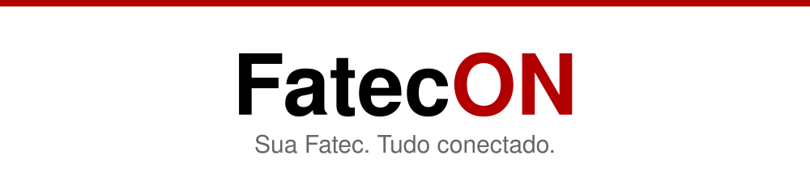

# FatecON

**Sua Fatec. Tudo conectado.**

Aplicativo mobile para melhorar a comunicação do estudante na Fatec Itaquera - Prof. Miguel Reale — projeto do Hackathon Fatec 2026.

## Documentação

- Especificação completa: [`FatecON_Documento_Completo_Projeto_Hackathon.md`](./FatecON_Documento_Completo_Projeto_Hackathon.md)
- Identidade visual: [`docs/identidade-visual.md`](./docs/identidade-visual.md)
- Planejamento da equipe: [`docs/planejamento-equipe.md`](./docs/planejamento-equipe.md)

## Papéis e escopo de publicação

| Papel | Pode publicar | Escopo |
| --- | --- | --- |
| Estudante | Publicações da comunidade | Comunidade estudantil |
| Professor | Avisos | Apenas suas turmas vinculadas |
| Coordenador de curso | Avisos oficiais | Apenas o seu curso (ex.: coord. de DSM → DSM) |
| Direção (evolução) | Avisos institucionais | Toda a unidade |

## Cursos da Fatec Itaquera

Desenvolvimento de Software Multiplataforma (DSM), Automação Industrial, Engenharia Mecânica, Fabricação Mecânica, Manutenção Industrial, Mecânica — Processos de Soldagem, Refrigeração/Ventilação e Ar Condicionado.

## Stack

- React Native + TypeScript + Expo
- Firebase (Auth, Cloud Firestore, Security Rules)
- Docker / Docker Compose

## Configuração

Copie o arquivo de exemplo e preencha as credenciais do Firebase (peça ao time):

```bash
cp .env.example .env
```

O `firebase.ts` inicializa o app somente quando as variáveis `EXPO_PUBLIC_FIREBASE_*` estão preenchidas; sem elas o app roda com os mocks de `src/services/mocks/`.

## Rodando com Docker

Requisitos: Docker + Docker Compose.

1. Informe o IP da sua máquina na rede local (necessário para o QR code funcionar no Expo Go dos celulares):

   ```bash
   export REACT_NATIVE_PACKAGER_HOSTNAME=192.168.0.10
   ```

2. Suba o ambiente:

   ```bash
   docker compose up
   ```

3. Escaneie o QR code com o app Expo Go (celular na mesma rede).

Alternativa sem Docker:

```bash
npm install
npx expo start
```

## Login

O acesso usa o e-mail institucional da Fatec (conta Microsoft, domínio `@fatec.sp.gov.br`) com senha. O botão "Entrar com conta Microsoft" (OAuth via Firebase Auth) está previsto como evolução.

## Diferencial — Acessibilidade

Ícone de acessibilidade no topo de todas as telas com **filtros de daltonismo no mesmo padrão do site oficial do CPS** (Acromatomia, Acromatopsia, Deuteranomalia, Deuteranopia, Protanomalia, Protanopia, Tritanomalia e Tritanopia) e **três níveis de tamanho de texto**, com a preferência salva no dispositivo.

## Equipe

- Pedro Henrique
